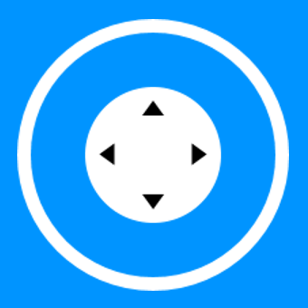
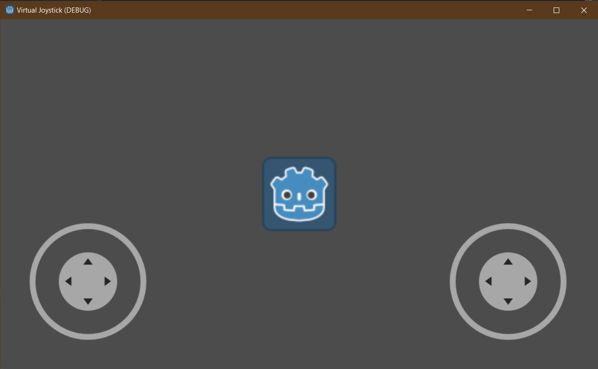
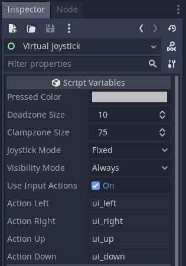
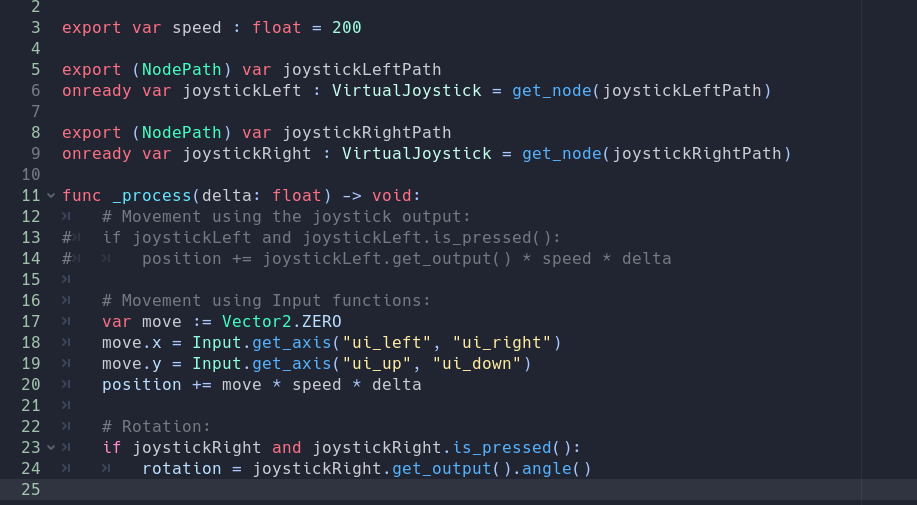

# Godot Virtual Joystick

This is a simple virtual joystick designed for touchscreens, with a focus on compatibility for iPad and large projector screen presentations. It comes with useful options that make it versatile for various applications.

GitHub Page: https://github.com/MarcoFazioRandom/Virtual-Joystick-Godot

Godot Engine: https://godotengine.org

## Purpose:

The primary purpose of this project is to provide an intuitive and user-friendly virtual joystick for touchscreen devices, specifically iPads, or for demos on large projector screens. The design aims to ensure seamless compatibility across these platforms while offering a robust set of features for customization and control.

## Previews:

Easy to setup:  

Easy to use:  

## Options:

- **Joystick mode:**

  - Fixed: The joystick doesn't move.
  - Dynamic: Every time the joystick area is pressed, the joystick position is set on the touched position.

- **Dead zone size:** If the tip is inside this range the output is zero.

- **Clamp zone size:** The max distance the tip can reach.

- **Visibility mode:**

  - Always: Always visible.
  - touchscreen only: Visible on touch screens only (will hide if the device has not a touchscreen).

- **Use input actions:** if true the joystick will trigger the input actions created in Project -> Project Settings -> Input Map

## Help:

- The Control parent of the joystick is the area in which the joystick can move in Dynamic mode.
- For moving the joystick inside his area, select it, right click, turn on "Editable Children" and then change the position of the Base node.
- With "Editable Children" turned on you can also edit the joystick textures and colors.
- To be able able to use multitouch and mouse, it's advised to go to Project -> Project Settings -> General -> Input Devices and turn ON "emulate touch from mouse" and turn OFF "emulate mouse from touch".
- Create a CanvasLayer node and name it "UI", it'll contain all the UI elements, then add the Joystick scene as a child of the UI node and move it where you prefer.
- An example scene is provided in the "Test" folder.
